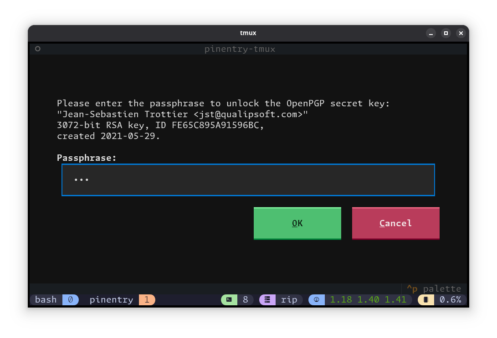

# pinentry-tmux

pinentry-tmux is a pinentry application for TTY and tmux use.



* * *

## Why?

pinentry programs usually come in two flavors: Graphical and TTY. For certain
programs like Neovim that take control of your TTY, a TTY pinentry is not an
option. And, when you also don't have a graphical environment available, you're
out of luck!

And so is born pinentry-tmux, which detects your tmux environment and opens a
separate window to display the pinentry query.

This fits into my regular work environment:
- `mosh` to a remote server (authenticated via SSH, but uses UDP to have a
  disconnection-resilient session) -- No X display forwarding possible.
- `tmux` session (re-connectable)
- `nvim` -> `git commit` -> `gpg-agent` -> `pinentry-tmux` -> `tmux new-session` -> remote `pinentry-tmux`.

For those times were an X graphical display is available, it falls back to
default graphical pinentry program is used so you get the best of both worlds!

Did I mention pinentry-tmux's prompt is so much nicer than the default TTY one?
Even if you don't use tmux, give it a try!

# Installation

## TL;DR

```sh
# Install uv
curl -LsSf https://astral.sh/uv/install.sh | sh
# Install pinentry-tmux
uv tool install "git+https://github.com/qualIP/pinentry-tmux"
# Configure gpg-agent
echo "pinentry-program $HOME/.local/bin/pinentry-tmux" >> "$HOME/.gnupg/gpg-agent.conf"
# Reload gpg-agent configuration
gpgconf --reload gpg-agent
```

## Detailed install and uninstall instructions

See [doc/installation.md](doc/installation.md).

# Implementation details

## Operation modes

At run time, decides on three modes:
- **X**: If X (DISPLAY environment variable) is available
  - falls back to running `/usr/bin/pinentry-x11`.
- **TMUX**: If the requesting process is running under tmux (TMUX environment
  variable)
  - Prompts for pin/passphrase in a temporary/new tmux window.
- **TTY**: If all else fails.
  - Prompts for pin/passphrase in the configured GPG TTY.

## Security considerations

- For communication with the separate tmux window, a user-owned temporary
  control directory is used to share information. The passphrase is exchanged
  using a named FIFO.
- In all cases, the pin/passphrase is NEVER written to disk and NOT exposed in
  any.

# TODO

- [ ] Use a tmux popup instead of a new window

# Alternatives

- Another pinentry-tmux implementation: https://github.com/eth-p/pinentry-tmux

# Acknowledgements

- This project was built from [simple-modern-uv](https://github.com/jlevy/simple-modern-uv).

# Donations

[](https://www.paypal.com/biz/fund?id=4CZC3J57FXJVE)
